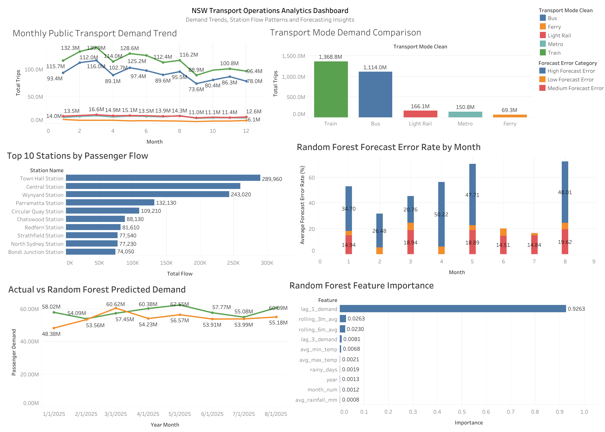

# NSW Transport Operations Analytics

## 1. Project Overview

This project analyses NSW public transport demand, station passenger flows, weather conditions and calendar effects to identify demand trends, station-level operational pressure, data quality risks and short-term demand forecasting opportunities.

The project was built as an end-to-end transport operations analytics workflow. It starts from raw public transport and weather datasets, cleans and restructures them into analytical tables, uses SQL to answer operational questions, builds a simple demand forecasting model, and prepares dashboard-ready datasets for Tableau.

The final output is designed for a transport operations or business analytics setting, where the goal is not only to report historical demand, but also to understand where network pressure occurs, how demand changes over time, and what data quality risks should be considered before using the results for planning decisions.

---

## 2. Business Problem

Public transport operators need reliable and repeatable analysis to support daily and long-term operational planning. Passenger demand changes by month, transport mode, station, weather conditions and calendar effects. At the same time, station-level congestion can create operational pressure even when overall network demand looks stable.

This project focuses on four business questions:

1. How has NSW public transport demand changed over time?
2. Which transport modes and passenger groups contribute most to total demand?
3. Which train stations show the highest passenger flow and peak-period pressure?
4. Can historical demand, calendar features and weather conditions support short-term demand forecasting?

The project also includes a data quality review because transport planning decisions depend heavily on consistent, complete and well-structured data.

---

## 3. Datasets Used

The project combines transport demand, station flow, GTFS reference data, weather observations and public holiday data.

| Dataset | File / Source Used in Project | Purpose |
|---|---|---|
| Opal trips by mode | `data/raw/NSW-2-Opal-trips-all-modes.csv` | Monthly public transport demand analysis by mode and card type |
| Train station entries and exits | `data/raw/NSW-train-station-entries-and-exits.csv` | Station flow, peak pressure and entry-exit imbalance analysis |
| GTFS static data | `data/raw/full_greater_sydney_gtfs_static_0/` | Station and route reference tables, mainly using `stops.txt` and `routes.txt` |
| Rainfall data | `data/raw/sydney_airport_daily_rainfall.csv` | Weather context for demand analysis |
| Temperature data | `data/raw/sydney_airport_daily_max_temp.csv`, `data/raw/sydney_airport_daily_min_temp.csv` | Monthly weather features for forecasting |
| NSW public holidays | `data/raw/nsw_public_holidays_2019_2023.csv` | Calendar and holiday features |

The raw datasets are transformed into cleaned and final analytical tables under `data/processed/` and `data/final/`.

---

## 4. Project Workflow

The project follows a typical analytics workflow:

```text
Raw data
   ↓
Data cleaning and standardisation
   ↓
Calendar, weather and GTFS feature engineering
   ↓
Fact and dimension table creation
   ↓
DuckDB SQL modelling and analysis
   ↓
Python visualisation and model development
   ↓
Tableau dashboard data export
   ↓
Business insights and recommendations
```

Main steps:

1. **Data loading**  
   Load Opal demand, station flow, weather, public holiday and GTFS files.

2. **Data cleaning**  
   Standardise column names, convert date fields, handle missing values, remove duplicates and prepare consistent analytical fields.

3. **Feature engineering**  
   Create calendar fields, holiday indicators, monthly weather features, lagged demand features and rolling average features.

4. **Data modelling**  
   Build fact and dimension tables, including monthly Opal trips, station flow, date, weather, station and route dimensions.

5. **SQL analysis**  
   Use DuckDB to run repeatable SQL queries for demand trends, station pressure, mode comparison and data quality checks.

6. **Forecasting model**  
   Build baseline, linear regression and random forest models to forecast monthly demand using lagged demand, rolling averages, calendar and weather features.

7. **Dashboard preparation**  
   Export clean dashboard-ready CSV files for Tableau.

8. **Business interpretation**  
   Summarise operational insights, data limitations and potential planning use cases.

---

## 5. Repository Structure

```text
nsw-transport-operations-analytics/
│
├── README.md
├── transport_analytics_v2.duckdb
│
├── data/
│   ├── raw/
│   │   ├── NSW-2-Opal-trips-all-modes.csv
│   │   ├── NSW-train-station-entries-and-exits.csv
│   │   ├── nsw_public_holidays_2019_2023.csv
│   │   ├── sydney_airport_daily_rainfall.csv
│   │   ├── sydney_airport_daily_max_temp.csv
│   │   ├── sydney_airport_daily_min_temp.csv
│   │   └── full_greater_sydney_gtfs_static_0/
│   │       ├── stops.txt
│   │       └── routes.txt
│   │
│   ├── processed/
│   │   ├── clean_opal_trips.csv
│   │   ├── clean_station_flow.csv
│   │   ├── clean_weather.csv
│   │   ├── dim_date.csv
│   │   ├── dim_station.csv
│   │   └── dim_route.csv
│   │
│   └── final/
│       ├── fact_monthly_opal_trips.csv
│       ├── fact_station_flow.csv
│       ├── dim_date.csv
│       ├── dim_weather.csv
│       ├── dim_station.csv
│       └── dim_route.csv
│
├── notebooks/
│   └── NSW_Transport_Operations_Analytics.ipynb
│
├── sql/
│   ├── create_tables.sql
│   ├── analysis_queries.sql
│   └── data_quality_checks.sql
│
├── outputs/
│   ├── charts/
│   ├── sql_exports/
│   └── model_results/
│
├── dashboard/
│   ├── dashboard_data/
│   ├── screenshots/
│   └── tableau/
│       ├── nsw_transport_dashboard.twbx
│       └── nsw_transport_dashboard.png
│
├── reports/
│   ├── project_summary.md
│   └── business_recommendations.md
│
└── src/
    ├── data_cleaning.py
    ├── feature_engineering.py
    ├── forecasting.py
    └── sql_utils.py
```

---

## 6. Key Outputs

### Processed and final analytical tables

The project creates cleaned datasets and final fact/dimension tables:

- `fact_monthly_opal_trips.csv`
- `fact_station_flow.csv`
- `dim_date.csv`
- `dim_weather.csv`
- `dim_station.csv`
- `dim_route.csv`

These tables are used for SQL analysis, forecasting and Tableau dashboard development.

### SQL exports

The SQL analysis results are exported under `outputs/sql_exports/`, including:

- `monthly_demand_trend.csv`
- `transport_mode_demand.csv`
- `card_type_demand.csv`
- `yearly_mode_demand.csv`
- `top_station_flow.csv`
- `peak_station_pressure.csv`
- `entry_exit_imbalance.csv`
- `yearly_station_flow_trend.csv`
- `monthly_demand_weather.csv`
- `data_quality_summary.csv`

### Charts

Python-generated charts are saved under `outputs/charts/`, including:

- Monthly demand trend
- Demand by transport mode
- Card type demand
- Yearly mode demand
- Top station flow
- Peak station pressure
- Entry-exit imbalance
- Weather and demand analysis
- Forecast actual vs predicted demand
- Feature importance
- Data quality overview

### Model outputs

Forecasting outputs are saved under `outputs/model_results/`:

- `model_metrics.csv`
- `forecast_results.csv`
- `feature_importance.csv`

---

## 7. SQL Analysis

DuckDB is used to create a lightweight analytical database for repeatable SQL analysis. The SQL layer makes the project closer to a real business analytics workflow, where cleaned tables are queried for reporting and operational monitoring.

The main SQL analysis covers:

### Monthly demand trend

This query tracks total public transport trips by year and month. It is used to identify long-term demand changes, seasonality and unusual demand drops or recoveries.

### Transport mode demand

This query compares total and average monthly trips across different transport modes, such as train, bus, ferry, metro and light rail. It helps show which modes carry the largest passenger volumes.

### Card type demand

This query analyses demand by passenger card type. It provides a high-level view of passenger composition, such as adult, concession, child/youth and senior/pensioner usage.

### Yearly mode demand

This query compares annual demand by transport mode. It is useful for understanding mode-level recovery patterns and long-term demand shifts.

### Top station flow

This query ranks stations by total entries and exits. In the current output, high-flow stations include Town Hall, Central, Wynyard, Parramatta and Circular Quay. These stations can be treated as key network pressure points for operational monitoring.

### Peak station pressure

This query calculates how much station flow is concentrated during peak periods. A high peak-flow share suggests that the station may require more attention during morning and evening commuting windows.

### Entry-exit imbalance

This query compares total entries and exits at each station. It helps identify stations that behave more like origin stations, destination stations or balanced interchange locations.

### Data quality checks

The data quality summary checks table row counts and duplicate records across the main analytical tables. This step is included to make the analysis more transparent and risk-aware.

---

## 8. Forecasting Model

The forecasting section predicts monthly public transport demand using historical demand, calendar and weather features.

### Features used

The model uses:

- Year and month
- Transport mode
- Average rainfall
- Average maximum temperature
- Average minimum temperature
- Number of rainy days
- Public holiday count
- `lag_1_demand`
- `lag_3_demand`
- `rolling_3m_avg`
- `rolling_6m_avg`

The time-series split uses historical data for training and later-period data for testing. This avoids random splitting, which would not be appropriate for time-dependent demand forecasting.

### Models compared

Three models are compared:

| Model | Purpose |
|---|---|
| Naive baseline | Uses previous-month demand as the prediction |
| Linear regression | Provides a simple interpretable statistical benchmark |
| Random forest | Captures non-linear relationships and supports feature importance analysis |

### Current model results

| Model | MAE | RMSE | MAPE | R² |
|---|---:|---:|---:|---:|
| Linear Regression | 860,998 | 1,175,743 | 4,985.54 | 0.9829 |
| Naive Baseline | 772,662 | 1,232,682 | 9.03 | 0.9813 |
| Random Forest | 1,145,301 | 1,576,408 | 1,131.99 | 0.9694 |

The naive baseline performs strongly because monthly transport demand has strong temporal persistence. In simple terms, this month’s demand is often close to last month’s demand. This is common in transport demand forecasting and makes the baseline a useful benchmark.

The feature importance output from the random forest model shows that `lag_1_demand` is the most important predictor, followed by rolling average demand features. This suggests that recent historical demand is more predictive than weather variables in the current monthly-level dataset.

One modelling limitation is that MAPE can become unstable when actual demand values are very small. For future improvement, WMAPE could be added as a more stable business metric for transport demand forecasting.

---

## 9. Tableau Dashboard Screenshot

The Tableau dashboard is saved under:

```text
dashboard/tableau/nsw_transport_dashboard.twbx
```

Dashboard screenshot:



The dashboard is designed to support stakeholder-facing transport operations reporting. It uses the exported CSV files under `dashboard/dashboard_data/`.

Main dashboard sections include:

1. Demand overview
2. Station flow and network insights
3. Forecasting and operational planning
4. Data quality and coverage

---

## 10. Key Insights

### 1. Public transport demand shows clear time-based variation

Monthly demand changes over time and is affected by seasonality, calendar effects and broader travel behaviour. Looking only at total annual demand would hide these monthly changes.

### 2. Demand should be monitored by transport mode

Different transport modes contribute different levels of demand and may follow different recovery or usage patterns. Mode-level analysis is more useful than only reporting total network demand.

### 3. A small number of stations carry a large share of passenger flow

Stations such as Town Hall, Central and Wynyard show high total passenger flow. These stations should be prioritised for operational monitoring because disruption or crowding at these locations can affect the broader network.

### 4. Peak-period pressure is different from total station volume

A station does not need to have the highest total annual flow to create operational pressure. If a high share of passenger movement occurs during peak windows, the station may still require targeted crowd management.

### 5. Entry-exit imbalance can support station role analysis

Entry-exit imbalance helps describe whether a station is mainly an origin station, a destination station or a more balanced interchange point. This can support planning for staffing, signage and passenger flow management.

### 6. Recent demand is the strongest forecasting signal

The forecasting model shows that lagged demand, especially previous-month demand, is the strongest predictor. This means rolling demand monitoring can be useful for short-term operational planning.

### 7. Data quality checks should be part of transport analytics delivery

The project includes row count and duplicate checks to make the analysis more reliable. For operational use, data quality monitoring should be extended to missing values, coverage gaps and inconsistent category labels.

---

## 11. Data Limitations

This project is designed as a portfolio analytics project and has several limitations:

1. **Aggregated demand level**  
   The Opal demand data is aggregated at a monthly level, so it cannot capture daily or hourly travel patterns.

2. **Limited station flow granularity**  
   Station entries and exits are useful for identifying major stations and pressure points, but they do not fully describe platform-level or service-level crowding.

3. **Weather data location**  
   Weather observations are based on Sydney Airport weather files. They may not fully represent weather conditions across all NSW transport areas.

4. **GTFS static data limitation**  
   GTFS static files provide route and stop reference information, but they do not represent real-time delays, cancellations or service disruptions.

5. **Forecasting scope**  
   The forecasting model predicts demand using historical, calendar and weather features. It does not include special events, fare changes, service disruptions, school terms or broader economic variables.

6. **MAPE sensitivity**  
   MAPE may be unstable when actual demand values are very small. Future versions should include WMAPE or SMAPE for more robust business interpretation.

7. **Category consistency**  
   Some categorical fields may require additional standardisation before production use, such as inconsistent capitalisation in transport mode labels.

---

## 12. How to Reproduce

### Step 1: Clone the repository

```bash
git clone https://github.com/Raina-Hong/nsw-transport-operations-analytics.git
cd nsw-transport-operations-analytics
```

### Step 2: Create a Python environment

```bash
python -m venv .venv
source .venv/bin/activate
```

For Windows:

```bash
.venv\Scripts\activate
```

### Step 3: Install required packages

```bash
pip install pandas numpy matplotlib scikit-learn duckdb jupyter
```

If a `requirements.txt` file is added later, use:

```bash
pip install -r requirements.txt
```

### Step 4: Check raw data location

Place the raw files under `data/raw/`:

```text
data/raw/
├── NSW-2-Opal-trips-all-modes.csv
├── NSW-train-station-entries-and-exits.csv
├── nsw_public_holidays_2019_2023.csv
├── sydney_airport_daily_rainfall.csv
├── sydney_airport_daily_max_temp.csv
├── sydney_airport_daily_min_temp.csv
└── full_greater_sydney_gtfs_static_0/
    ├── stops.txt
    └── routes.txt
```

### Step 5: Run the notebook

```bash
jupyter notebook notebooks/NSW_Transport_Operations_Analytics.ipynb
```

Run the notebook from top to bottom. It will generate:

- cleaned datasets under `data/processed/`
- final fact and dimension tables under `data/final/`
- SQL outputs under `outputs/sql_exports/`
- model results under `outputs/model_results/`
- charts under `outputs/charts/`
- Tableau-ready CSV files under `dashboard/dashboard_data/`

### Step 6: Open the Tableau dashboard

Open:

```text
dashboard/tableau/nsw_transport_dashboard.twbx
```

The dashboard uses the exported CSV files from `dashboard/dashboard_data/`.

---

## 13. Resume Bullet Points

**NSW Transport Operations Analytics Project | Python, SQL, DuckDB, Tableau**

- Built an end-to-end transport operations analytics workflow using NSW Opal trips, station entries/exits, GTFS, weather and calendar data to monitor demand trends, station pressure and data quality risks.
- Cleaned and transformed raw transport datasets into fact and dimension tables using Python and DuckDB, enabling repeatable SQL analysis of monthly demand, station flow, peak pressure and entry-exit imbalance.
- Developed SQL-based operational analysis covering transport mode demand, passenger card type composition, top station flow, yearly demand trends and data quality checks.
- Built demand forecasting models using lagged demand, rolling averages, weather and calendar features, and benchmarked model performance against a naive previous-month baseline.
- Created a Tableau dashboard to visualise demand trends, station bottlenecks, forecast results and data quality indicators for stakeholder-facing operational reporting.
