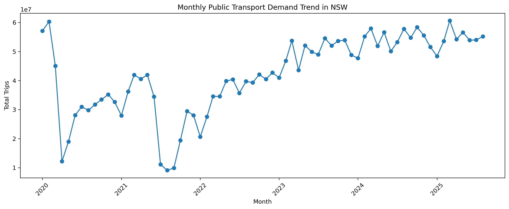
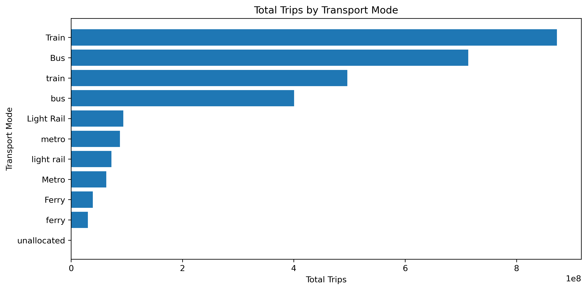
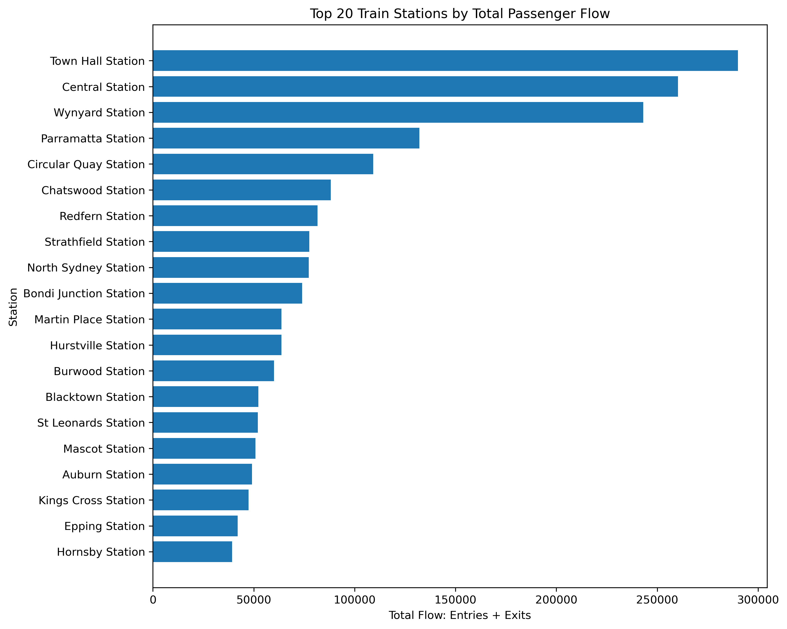
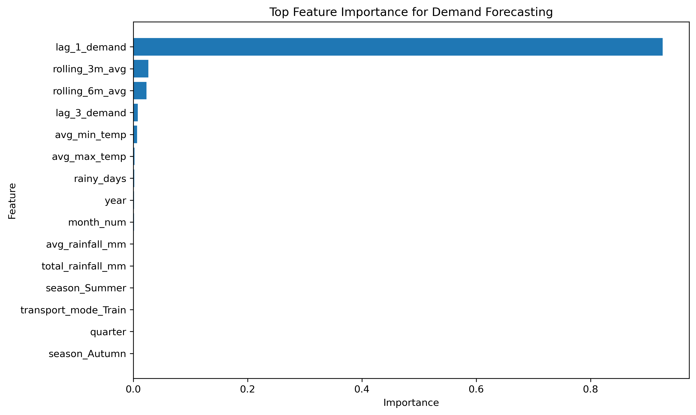

# NSW Transport Operations Analytics Report

## 1. Executive Summary

This project analyses NSW public transport demand, station passenger flows, weather conditions and calendar effects to identify demand trends, station-level operational pressure, data quality risks and short-term demand forecasting opportunities.

The project was designed as an end-to-end transport operations analytics workflow. Raw transport, station flow, weather, calendar and GTFS reference data were cleaned with Python, transformed into analytical fact and dimension tables, queried with DuckDB SQL, and visualised through Tableau dashboards.

The analysis focuses on three practical questions:

1. How does public transport demand vary over time and across transport modes?
2. Which stations show higher passenger flow and possible operational pressure?
3. Can historical demand, calendar and weather features support short-term demand forecasting?

The final outputs include cleaned datasets, SQL exports, forecasting model results, feature importance analysis and two Tableau dashboards. The first dashboard provides an operations overview, while the second dashboard focuses on demand patterns, YTD growth, weather relationships and forecasting performance.

---

## 2. Business Problem

Public transport operators need reliable visibility into passenger demand, station flow and short-term demand changes. Demand is not constant across months, transport modes or stations. It can also be affected by weather, holidays, seasonality and longer-term behaviour changes.

Without a structured analytics workflow, it is difficult to answer operational questions such as:

- Which transport modes carry the highest demand?
- Which stations may need closer monitoring due to passenger flow pressure?
- Are there recurring monthly demand patterns?
- How does current demand compare with the previous year?
- Can demand be forecasted using historical trends and external features?

This project addresses these questions by building a repeatable analytics pipeline for transport operations reporting. The workflow combines Python, SQL and Tableau to move from raw data to business-facing insights.

---

## 3. Data Sources and Coverage

The project uses multiple public datasets related to NSW transport operations and external demand drivers.

| Dataset | Main Use |
|---|---|
| NSW Opal monthly trips | Monthly demand trend and transport mode analysis |
| Train station entries and exits | Station flow, entry-exit comparison and station pressure analysis |
| GTFS static data | Station and route reference information |
| Weather observations | Rainfall, temperature and rainy-day features |
| NSW public holidays | Calendar and holiday features |

The Opal monthly trip data covers demand from 2020 to 2025. The 2025 data is year-to-date rather than a complete calendar year, so annual comparisons involving 2025 are treated as YTD comparisons. Station entry-exit data is available for selected years and is mainly used for station-level operational analysis. Weather observations are based on Sydney Airport data and are used as a proxy for broader Greater Sydney weather conditions.

The final analytical datasets were organised into fact and dimension tables, including:

- `fact_monthly_opal_trips`
- `fact_station_flow`
- `dim_date`
- `dim_station`
- `dim_route`
- `dim_weather`

This structure makes the project easier to query, reproduce and extend.

---

## 4. Methodology

### 4.1 Data Cleaning

Python was used to clean and standardise the raw datasets before analysis. The cleaning process included:

- standardising column names;
- parsing date and month fields;
- converting passenger count fields into numeric values;
- handling missing or inconsistent values;
- standardising transport mode names;
- filtering records to the project analysis period.

Transport mode names were cleaned carefully because inconsistent labels such as `bus` and `Bus` can create duplicate categories in both SQL outputs and Tableau visualisations.

The station flow dataset also required additional cleaning because entries and exits were split across different time windows. These columns were converted into numeric fields and used to calculate total flow, peak flow and entry-exit imbalance.

---

### 4.2 Feature Engineering

Several additional features were created to support SQL analysis, dashboarding and forecasting.

Calendar features included:

- year;
- quarter;
- month;
- month name;
- weekday;
- weekend flag;
- public holiday flag;
- season.

Weather features included:

- rainfall amount;
- rainy-day flag;
- weather category;
- average monthly rainfall;
- total monthly rainfall;
- rainy days per month;
- average maximum and minimum temperature.

For forecasting, lag and rolling demand features were created:

- previous-month demand;
- lag-3 demand;
- rolling 3-month average demand;
- rolling 6-month average demand.

These features help capture the persistence and seasonality of monthly transport demand.

---

### 4.3 Fact and Dimension Table Design

The cleaned data was transformed into fact and dimension tables to support repeatable analysis.

The main fact tables are:

| Table | Description |
|---|---|
| `fact_monthly_opal_trips` | Monthly passenger trips by transport mode and card type |
| `fact_station_flow` | Station-level entries, exits, total flow and peak-flow indicators |

The main dimension tables are:

| Table | Description |
|---|---|
| `dim_date` | Calendar, season, weekend and holiday attributes |
| `dim_station` | Station reference information from GTFS stops |
| `dim_route` | Route reference information from GTFS routes |
| `dim_weather` | Daily rainfall and temperature observations |

This design separates measures from reference attributes and makes the SQL layer easier to maintain.

---

### 4.4 SQL Analytical Layer

DuckDB was used to create a lightweight SQL analytical layer on top of the final CSV tables. This allowed the project to move beyond one-off Python analysis and produce reusable SQL outputs for reporting.

The SQL layer includes queries for:

- monthly demand trends;
- demand by transport mode;
- card type demand;
- top station passenger flow;
- peak station pressure;
- entry-exit imbalance;
- yearly station flow trends;
- monthly seasonality;
- YTD YoY demand growth;
- weather-demand relationship analysis;
- data quality summary.

This makes the project closer to a recurring operations reporting workflow rather than a single static dashboard.

---

### 4.5 Forecasting Workflow

A monthly demand forecasting workflow was built to predict passenger demand by transport mode. The forecasting task used historical demand, calendar and weather features.

Three models were compared:

1. Naive baseline  
2. Linear regression  
3. Random forest regression  

The naive baseline uses previous-month demand as the prediction. This is a useful benchmark because public transport demand often has strong month-to-month persistence.

Linear regression was included as a simple interpretable model. Random forest was included to capture non-linear relationships and provide feature importance analysis.

---

### 4.6 Tableau Dashboard Development

The Tableau workbook was designed as two dashboards.

The first dashboard, **Operations Overview**, focuses on demand trends, transport mode demand, station passenger flow, entry-exit comparison and data coverage.

The second dashboard, **Demand Patterns and Forecasting Insights**, focuses on monthly seasonality, YTD YoY growth, weather-demand relationships and forecasting model performance.

The two-dashboard design was used to avoid overcrowding one dashboard with too many charts. It also separates operational monitoring from deeper analytical insights.

---

## 5. SQL-Based Analysis and Key Results

### 5.1 Monthly Demand Trend

The monthly demand analysis shows that Train and Bus are the dominant transport modes in the NSW public transport network. Their demand levels are much higher than Light Rail, Metro and Ferry.

The trend also shows that demand varies across months. This suggests that monthly monitoring is more useful than relying only on annual totals, especially for operational planning and service review.

---

### 5.2 Transport Mode Demand

Transport mode demand comparison confirms that Train and Bus account for the largest share of total passenger trips. Light Rail, Metro and Ferry contribute smaller volumes, but they are still important for understanding network coverage and mode-specific changes.

This finding suggests that network-wide demand monitoring should prioritise Train and Bus, while still tracking smaller modes separately because their growth patterns may differ.

---

### 5.3 Station Flow and Entry-Exit Imbalance

The station flow analysis identifies high-volume stations such as Town Hall, Central and Wynyard as major passenger flow points. These stations should be treated as key locations for operational monitoring because large passenger volumes can increase crowding and service pressure.

Entry-exit comparison adds another layer of operational insight. Some stations may have relatively balanced entries and exits, while others show stronger directional flow. This can help identify stations where crowd movement, peak-hour planning or passenger circulation may need closer review.

---

### 5.4 Monthly Seasonality

Monthly seasonality analysis shows recurring demand patterns across transport modes. Train and Bus have much higher demand levels than other modes, but their monthly patterns still fluctuate.

This analysis is useful because seasonality can affect staffing, service planning and crowd management. Instead of treating every month as the same, transport operations teams can use seasonal patterns to support planning decisions.

---

### 5.5 YTD YoY Demand Growth

YoY demand growth was calculated carefully because the 2025 Opal data is year-to-date rather than a complete year. To avoid comparing partial-year 2025 data with full-year 2024 data, the analysis uses a YTD comparison.

In other words, 2025 demand is compared with the same months in 2024.

This makes the comparison fairer and avoids overstating demand declines simply because 2025 has fewer months of available data.

Metro shows strong YTD growth, but this should be interpreted together with its base demand volume. A smaller previous-year base can make percentage growth look much larger.

---

### 5.6 Weather-Demand Relationship

Weather-demand analysis links monthly demand with rainfall, rainy days and temperature features. The scatter plot shows how demand varies across months with different numbers of rainy days.

Weather alone does not fully explain transport demand, but it provides a useful external signal. In the forecasting model, historical demand features are still much stronger predictors than weather variables. However, rainfall and rainy-day features can still support broader operational monitoring.

---

## 6. Forecasting Model

### 6.1 Forecasting Objective

The forecasting task aims to predict monthly passenger demand by transport mode. The goal is not to build a production-grade forecasting system, but to evaluate whether historical demand, weather and calendar features can support short-term demand prediction.

The model output is useful for understanding forecast performance, identifying important predictors and comparing simple benchmarks with machine learning models.

---

### 6.2 Feature Set

The forecasting dataset includes calendar, weather and historical demand features.

| Feature Group | Features |
|---|---|
| Calendar | year, month, quarter, season |
| Transport mode | transport mode category |
| Weather | rainfall, rainy days, average max temperature, average min temperature |
| Demand history | lag-1 demand, lag-3 demand, rolling 3-month average, rolling 6-month average |

Lagged demand features were especially important because monthly public transport demand tends to be strongly related to recent demand.

---

### 6.3 Models Compared

Three models were compared.

| Model | Purpose |
|---|---|
| Naive baseline | Uses previous-month demand as a simple benchmark |
| Linear regression | Provides a simple interpretable model |
| Random forest | Captures non-linear patterns and provides feature importance |

The naive baseline is important because a more complex model should be compared against a simple historical benchmark. If a simple baseline performs well, the forecasting problem may be strongly driven by recent demand persistence.

---

### 6.4 Evaluation Metrics

The model was evaluated using MAE, RMSE, WMAPE and R2.

| Metric | Interpretation |
|---|---|
| MAE | Average absolute forecast error in passenger trips |
| RMSE | Penalises larger forecast errors more strongly |
| WMAPE | Total absolute error as a percentage of total actual demand |
| R2 | Share of demand variation explained by the model |

Standard MAPE was not used as the main metric because demand volumes differ significantly across transport modes. When actual demand is small, MAPE can become unstable and produce misleadingly large percentage errors.

WMAPE is more stable for this project because it measures total absolute error relative to total actual demand.

---

### 6.5 Model Results

The model results show that the naive baseline performs strongly. This suggests that monthly public transport demand has strong temporal persistence.

Linear regression also performs well and achieves a high R2 value. Random forest provides useful interpretability through feature importance, even though it does not outperform the baseline on every metric.

The feature importance analysis shows that lag-1 demand is the most important predictor. This means the previous month’s demand is the strongest signal for predicting current monthly demand.

This result is reasonable for transport demand forecasting. In a real operations setting, simple baseline models should be included before relying on more complex models.

---

## 7. Tableau Dashboard Design

Two Tableau dashboards were created to communicate the project outputs.

### Dashboard 1: NSW Transport Operations Analytics Dashboard

The first dashboard provides an operational overview. It includes:

- monthly public transport demand trend;
- demand comparison by transport mode;
- top stations by passenger flow;
- station entries vs exits;
- data coverage summary.

This dashboard is designed for stakeholders who need a quick view of demand and station flow patterns.

---

### Dashboard 2: Demand Patterns and Forecasting Insights

The second dashboard provides deeper analysis. It includes:

- monthly demand seasonality;
- YTD YoY demand growth;
- weather-demand relationship;
- actual vs forecasted demand;
- random forest feature importance;
- model performance summary.

This dashboard is designed to show the analytical depth behind the project, including SQL-based patterns and forecasting results.

---

## 8. Key Findings and Recommendations

### Finding 1: Train and Bus dominate passenger demand

Train and Bus account for the largest share of public transport trips. These modes should be prioritised in network-wide demand monitoring and recurring operational reporting.

**Recommendation:** Use Train and Bus demand as core indicators in monthly performance reporting, while still tracking smaller modes for growth and service changes.

---

### Finding 2: Major CBD stations are key operational pressure points

Town Hall, Central and Wynyard show high passenger flow. These stations are likely to require closer monitoring because they concentrate a large share of passenger movement.

**Recommendation:** Prioritise high-flow stations for crowd monitoring, station capacity review and peak-period operational planning.

---

### Finding 3: Demand shows recurring monthly patterns

Monthly seasonality analysis shows that demand varies by month and transport mode. This means operational planning should not treat every month as identical.

**Recommendation:** Use monthly seasonality patterns to support service planning, staffing assumptions and demand review cycles.

---

### Finding 4: YTD comparison is needed for incomplete-year data

The 2025 Opal dataset is not a complete year. A full-year YoY comparison would be misleading. The project therefore uses YTD YoY growth to compare 2025 demand with the same months in 2024.

**Recommendation:** For incomplete-year data, always use comparable-period analysis instead of full-year comparisons.

---

### Finding 5: Historical demand is the strongest forecasting signal

The forecasting model shows that lagged demand is the strongest predictor. The naive baseline also performs strongly, which confirms that recent demand is highly informative.

**Recommendation:** Use simple historical-demand baselines as part of any future forecasting workflow before introducing more complex machine learning models.

---

## 9. Data Limitations

There are several limitations to this project.

First, the Opal trip data is monthly rather than daily or hourly. This limits the ability to analyse short-term disruptions, peak-hour crowding or day-level travel behaviour.

Second, the station entry-exit dataset is only available for selected years. This limits long-term station-level trend analysis.

Third, weather observations are based on Sydney Airport data. This is a practical proxy for Greater Sydney conditions, but it does not capture local weather variation across all stations.

Fourth, 2025 Opal demand data is year-to-date rather than a complete calendar year. Any annual comparison involving 2025 should therefore be interpreted as YTD analysis.

Finally, the forecasting model does not include major events, service disruptions, timetable changes, fare changes or real-time operational data. These factors could improve forecasting performance in a more advanced version of the project.

---

## 10. Conclusion

This project demonstrates how public transport datasets can be transformed into a repeatable analytics workflow for transport operations monitoring.

By combining Python-based data cleaning, DuckDB SQL analysis, Tableau dashboarding and forecasting models, the project identifies demand trends, station pressure points, monthly demand patterns, weather-demand relationships and short-term forecasting opportunities.

The main value of the project is not only the final dashboard, but the full workflow from raw data to business-facing insight. The project can be extended in the future by adding daily trip data, real-time service disruption data, event calendars and more granular station-level forecasting features.
